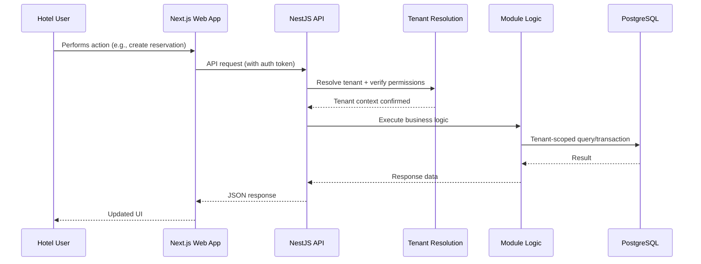

# PROPETRA — Data Flow

> **Status: Proposed conceptual flow**, illustrating how data moves through the system for representative operations.

## General Request Flow



## Example: Creating a Reservation

1. Front desk user submits a new reservation via the web app.
2. The API authenticates the user and resolves their tenant.
3. The Reservation module checks room availability (via Room Management) within that tenant only.
4. A reservation record is created, scoped to the tenant, room, and guest.
5. A response confirms the reservation; the UI updates to reflect the new booking.
6. The action is recorded in the audit log with tenant, user, and timestamp.

## Example: TEAM PETRA Onboarding a New Hotel

1. A TEAM PETRA administrator creates a new Tenant record via the Administration module.
2. An initial Hotel record and a Hotel Administrator user are created for that tenant.
3. The new tenant's workspace is now available, isolated from all existing tenants, with no data visible from other hotels.
4. The action is recorded in a platform-level audit log.

## Example: Guest Check-In Through Billing

```text
Reservation (existing)
    ↓
Front Desk check-in
    ↓
Stay record created
    ↓
Housekeeping notified of upcoming checkout expectations (future consideration)
    ↓
Stay ends → Invoice generated from Stay charges
    ↓
Payment recorded against Invoice
    ↓
Reports reflect completed stay and revenue
```

## Cross-Cutting Data Flow Concerns

- **Tenant context** flows through every layer of every request; it is never optional.
- **Audit events** are emitted alongside primary business operations rather than reconstructed after the fact.
- **Reports** consume data read-only from other modules and never become an alternate write path.

## Explicitly Not Yet Decided

- Whether any of these flows will eventually involve asynchronous background jobs (e.g., invoice generation triggered asynchronously rather than synchronously at checkout) — deferred until a real performance or workflow need arises.
