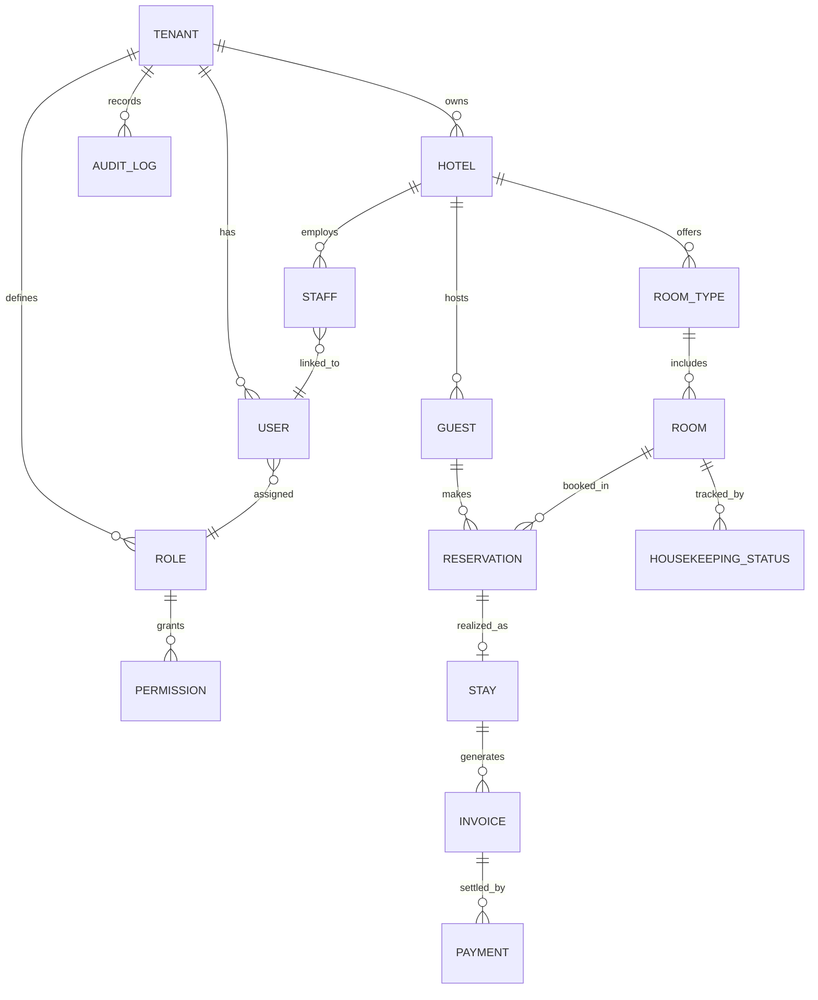

# PROPETRA — Database Architecture

> **Status: Proposed conceptual data model.** No schema has been implemented yet. This defines direction for Prisma modeling in later phases.

## Modeling Approach

- Single PostgreSQL database, shared schema, tenant-scoped via `tenant_id` (see `MULTI-TENANCY.md`).
- Prisma ORM for schema definition, migrations, and type-safe access.
- Kept intentionally minimal at this stage — only entities needed to support the core PMS capabilities. Additional entities are added as later phases require them, not speculatively.

## Core Entities

| Entity | Purpose | Tenant-Owned? |
|---|---|---|
| Tenant | Represents a hotel client on the platform | N/A (this *is* the tenant boundary) |
| Hotel | Property-level details for the tenant (name, address, contact info) | Yes |
| User | An account belonging to a tenant, or a TEAM PETRA admin account | Yes (or platform-level for admins) |
| Role | Named permission set assignable to users within a tenant | Yes |
| Permission | Individual capability that can be granted via a role | Shared/reference data |
| Room Type | A category of room (e.g., configuration, base rate reference) | Yes |
| Room | A physical room belonging to a hotel | Yes |
| Guest | A person who stays at or books with the hotel | Yes |
| Reservation | A booking linking a guest to a room/date range | Yes |
| Stay | The realized occupancy record tied to a reservation (check-in/check-out) | Yes |
| Invoice | A billing record associated with a stay/reservation | Yes |
| Payment | A payment applied against an invoice | Yes |
| Housekeeping Status | Current cleaning/readiness state of a room | Yes |
| Staff | Hotel employee record, distinct from (but linked to) a User account | Yes |
| Audit Log | Record of significant actions for security and accountability | Yes (plus platform-level entries for TEAM PETRA actions) |

## Key Relationships

## Entity Notes

**Tenant** — The root isolation boundary. Every tenant-owned table carries a `tenant_id` foreign key to this entity, enforced consistently across the data-access layer.

**Hotel** — Represents the property itself. In the current model, one Tenant maps to one Hotel; the relationship is modeled as one-to-many to leave room for a future multi-property tenant without a breaking schema change.

**User / Role / Permission** — Users belong to a tenant and are assigned roles; roles are composed of permissions. TEAM PETRA administrative users are a separate category, not scoped to any single tenant (see `USER-ROLES.md`).

**Room Type / Room** — Room Type defines a category (used for rates and configuration); Room is the physical, bookable unit belonging to a specific hotel.

**Guest** — A person associated with a hotel's bookings. Not a platform-wide identity — guest records belong to the tenant that collected them.

**Reservation / Stay** — A Reservation is the booking; a Stay is the operational record of the guest actually occupying the room (check-in through check-out). Modeling them separately supports cases like no-shows or cancellations without conflating booking intent with realized occupancy.

**Invoice / Payment** — An Invoice aggregates charges for a Stay; one or more Payments settle an Invoice. Financial correctness (no partial writes, no orphaned payments) depends on proper use of database transactions (see `SECURITY-ARCHITECTURE.md`).

**Housekeeping Status** — Tracks the current cleaning/readiness state of a Room, updated by housekeeping staff.

**Staff** — Represents the employment/operational record for hotel personnel, linked to (but distinct from) their User login account, since not every staff role necessarily requires system access.

**Audit Log** — Records significant actions (e.g., changes to reservations, billing, permissions) with tenant context, actor, and timestamp, supporting accountability and dispute resolution.

## Constraints and Integrity Principles

- Foreign keys enforce that child records (e.g., Room, Reservation) cannot exist without a valid parent (e.g., Hotel, Tenant).
- Financial operations (invoice creation, payment application) are wrapped in database transactions to avoid inconsistent states.
- Soft deletion (retaining records with a status flag) is preferred over hard deletion for entities with financial or audit significance (e.g., Reservation, Invoice, Payment) — exact policy to be finalized when the relevant module is implemented.
- Migrations are the only sanctioned way to change schema (see `DEVELOPMENT-RULES.md`); no manual production schema edits.

## Explicitly Not Yet Decided

- Exact column-level schema (field types, indexes) — to be defined at implementation time in Prisma.
- Data retention/archival policy.
- Full permission catalog (initial roles are outlined in `USER-ROLES.md`, but the complete permission list will grow with each module).
