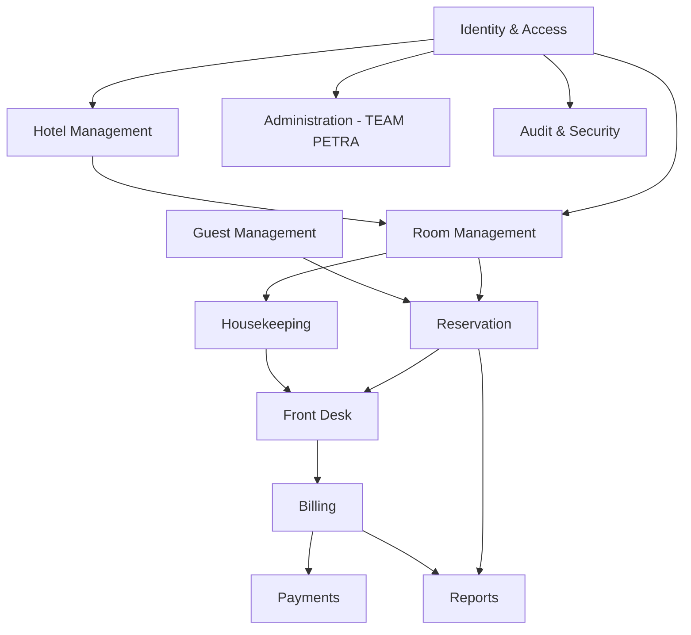

# PROPETRA — Module Architecture

> **Status: Proposed.** Defines module boundaries for the NestJS modular monolith.

## Purpose

PROPETRA's backend is organized as a set of clearly bounded modules within a single deployable application (modular monolith — see `SYSTEM-ARCHITECTURE.md`). Clean module boundaries now make it realistic to extract a module into its own service later, if scale ever justifies it, without a full rewrite.

## Proposed Modules

```text
Identity & Access
Hotel Management
Room Management
Reservation
Guest Management
Front Desk
Housekeeping
Billing
Payments
Reports
Notifications
Administration (TEAM PETRA)
Audit & Security
```

## Module Responsibilities

**Identity & Access** — Authentication, sessions/tokens, user accounts, roles, and permissions. Owns the tenant-resolution mechanism used by every other module.

**Hotel Management** — Hotel-level configuration and profile data for a tenant.

**Room Management** — Room types and physical rooms belonging to a hotel.

**Reservation** — Booking creation, modification, and cancellation, linking guests to rooms and date ranges.

**Guest Management** — Guest profiles and stay-relevant information, scoped to the owning tenant.

**Front Desk** — Check-in/check-out operations and day-to-day stay management, building on Reservation and Room Management.

**Housekeeping** — Room readiness/cleaning status, consumed by Front Desk when assigning rooms.

**Billing** — Invoice generation tied to stays/reservations.

**Payments** — Recording and reconciling payments against invoices.

**Reports** — Read-oriented aggregation and analytics across a tenant's own data (does not own primary data; queries other modules' data).

**Notifications** — Sends guest- or staff-facing notifications (e.g., booking confirmations); channel/provider to be decided.

**Administration (TEAM PETRA)** — Platform-level operations: tenant onboarding, platform configuration, cross-tenant operational visibility (not tenant content).

**Audit & Security** — Central audit logging and security-relevant event tracking, consumed by (but not depended upon by) other modules.

## Module Interaction Principles

- A module owns its own data; other modules access it only through defined interfaces (service calls within the monolith), never by querying another module's tables directly.
- Identity & Access and Audit & Security are foundational — nearly every other module depends on them, but they do not depend back on business modules.
- Reports is read-only with respect to other modules' data and must not become a place where business logic is duplicated.
- Administration (TEAM PETRA) operates at a different scope (cross-tenant) than the rest of the modules (single-tenant) and must be carefully isolated from tenant-facing code paths.

## Dependency Direction (Conceptual)



## Explicitly Not Yet Decided

- Whether any module will be extracted into a standalone service, and under what conditions — deferred until real scaling needs appear (see `DEVELOPMENT-RULES.md`: no premature microservices).
- Final internal folder/package structure within the NestJS codebase (to be established at implementation time, consistent with these module boundaries).
