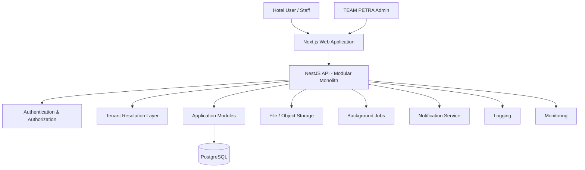

# PROPETRA — System Architecture

> **Status: Proposed high-level architecture.** Reflects intended direction, not an implemented system.

## Architectural Style

PROPETRA begins as a **modular monolith**: a single deployable backend application, internally organized into clearly bounded modules (see `MODULE-ARCHITECTURE.md`), rather than a microservices architecture. Module boundaries are kept clean enough that individual modules could be extracted into separate services later, if and when real scaling needs justify that complexity.

## High-Level Component Overview



## Components

### Frontend (Next.js / React / TypeScript)
Serves the hotel-facing PMS interface and the TEAM PETRA administration interface. Communicates with the backend exclusively through the API layer.

### Backend API (NestJS / TypeScript)
A single modular monolith exposing a REST API (see `API-ARCHITECTURE.md`). Internally composed of independent modules (see `MODULE-ARCHITECTURE.md`) that each own their own data and business logic.

### Authentication & Authorization
Handles user login, session/token issuance, and role-based access control. Authorization decisions always consider both the user's role and their tenant context — a user can never act outside their assigned hotel workspace (except TEAM PETRA administrative accounts, which operate at the platform level).

### Tenant Resolution Layer
Determines which hotel (tenant) a given request belongs to, and ensures every downstream database query and business operation is scoped to that tenant. See `MULTI-TENANCY.md` for full detail.

### Application Modules
The core business logic, organized by domain (rooms, reservations, guests, billing, housekeeping, etc.). Each module is tenant-aware and interacts with the database through well-defined boundaries.

### Database (PostgreSQL via Prisma)
A single shared relational database (proposed direction — see `MULTI-TENANCY.md`) storing all tenant data, with tenant ownership enforced at the schema and query level.

### File / Object Storage
Used for artifacts such as guest documents or exported reports. Provider not yet decided (see `INFRASTRUCTURE.md`).

### Background Jobs
Reserved for asynchronous or scheduled work (e.g., nightly reports, reminder notifications) where needed. Not required for the earliest phases; introduced only when a real use case exists.

### Notifications
Reserved for guest- or staff-facing notifications (e.g., booking confirmations). Delivery channel and provider are future decisions.

### Logging & Monitoring
Application and security-relevant events are logged centrally. Monitoring covers system health and availability across all tenants. Specific tooling is a future infrastructure decision.

## Request Flow (Conceptual)

```text
Hotel User
    ↓
Next.js Web Application
    ↓
NestJS API (Auth → Tenant Resolution → Module Logic)
    ↓
PostgreSQL (tenant-scoped query)
    ↓
Response back to Web Application
```

## Design Constraints Carried Through the Architecture

- Every request that touches tenant data must pass through tenant resolution and authorization before reaching business logic.
- Modules must not directly reach into another module's data; cross-module interaction happens through defined interfaces.
- The architecture must remain readable and explainable to a new developer (or AI) without requiring the original design conversation — this document, together with `MODULE-ARCHITECTURE.md` and `MULTI-TENANCY.md`, is intended to be sufficient.
